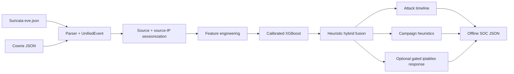

<div align="center">

# AEGIS-HYBRID

### From Deception to Learning — an offline hybrid behavioral detection research prototype

Suricata + Cowrie telemetry → normalized events → source-specific sessions → feature engineering → calibrated XGBoost → heuristic fusion → SOC-oriented verdicts

[](https://www.python.org/)
[](tests/)
[](docs/PROJECT_STATUS.md)
[](SECURITY.md)

</div>

> **Scope first:** AEGIS-HYBRID is an offline/batch cybersecurity research prototype. It is **not** a production IDS/IPS, SIEM, live/streaming detector, or verified APT detector.

## Why AEGIS-HYBRID?

Signature-based network alerts and honeypot activity provide different views of attacker behavior. AEGIS-HYBRID explores a practical hybrid approach: normalize telemetry from **Suricata** and **Cowrie**, reconstruct source-specific behavioral sessions, derive behavioral features, score sessions with a calibrated **XGBoost** model, and combine that score with deterministic behavioral heuristics.

The goal is not to claim perfect detection. The goal is to make the detection path **traceable, testable, and explicit about its evidence and limitations**.

## What is actually implemented?

| Capability | Status |
|---|---|
| Suricata `eve.json` parsing | Core |
| Cowrie JSON parsing | Core |
| Shared `UnifiedEvent` normalization | Core |
| Source + source-IP sessionization | Core |
| Behavioral feature engineering | Core |
| Calibrated XGBoost scoring | Core |
| Hand-tuned ML + behavioral fusion | Core / heuristic |
| Attack timeline analysis | Core / heuristic |
| Campaign analysis | Core / heuristic |
| Lab-only `iptables` response | Implemented, disabled by default |
| Cross-source per-attacker session correlation | **Not implemented** |
| Live/streaming detection | **Not implemented** |
| Dashboard | **Not included** |
| MITRE mapping | Experimental / not wired |
| Isolation Forest | Experimental / not wired |
| LLM investigation summaries | Experimental / not wired |

See [`docs/PROJECT_STATUS.md`](docs/PROJECT_STATUS.md) for the canonical implementation classification.

## Architecture



### The important architectural boundary

Both telemetry sources pass through the same normalization and detection pipeline, but the canonical session builder groups by **`source + src_ip`**. Suricata and Cowrie records therefore do **not** become one cross-source attacker session today. The term *hybrid* refers to the combination of multi-source telemetry, ML scoring, and behavioral fusion—not to a completed cross-source correlation engine.

## Detection flow

```text
Telemetry files
    ↓
Parsing + normalization
    ↓
Source-specific behavioral sessions
    ↓
Feature engineering
    ↓
Calibrated XGBoost probability
    ↓
Hand-tuned behavioral fusion
    ↓
Threshold decision
    ↓
Timeline / campaign heuristics
    ↓
SOC-oriented JSON output
```

The canonical entry point is [`pipeline/offline_pipeline.py`](pipeline/offline_pipeline.py). Components under `experimental/` are intentionally excluded from this path.

## A concrete detection example

A session containing high port spread, multiple behavioral stages, elevated event rate, and other risk indicators can receive a higher fused threat score. If that score crosses the configured detection threshold, the pipeline records a detection, derives a heuristic attack timeline/campaign view, and evaluates the optional response gate.

This is **behavioral scoring**, not proof of attribution or proof of an APT campaign.

## Evaluation integrity

The repository intentionally does **not** ship a trained model, raw telemetry, or generated benchmark metrics.

The original dataset builder uses heuristic labels:

- Cowrie attack sessions → attack label.
- Suricata sessions → label derived from alert-ratio thresholds.
- Ambiguous Suricata sessions → excluded.

This creates a real risk that the classifier learns source-specific artifacts rather than general malicious behavior. The evaluation methodology is therefore documented as a research limitation, not presented as a production benchmark.

The training path uses a deterministic **train / validation / test** split. The decision threshold is selected on validation data and the final metrics are reserved for the test split. Do not report historical thesis metrics as results of this repository.

See:

- [`docs/ML_METHODOLOGY.md`](docs/ML_METHODOLOGY.md)
- [`docs/EVALUATION.md`](docs/EVALUATION.md)
- [`docs/LIMITATIONS.md`](docs/LIMITATIONS.md)

## Quick start

Python **3.11+** is required by the canonical pipeline.

```bash
git clone https://github.com/SabreenYahya/AEGIS-HYBRID.git
cd AEGIS-HYBRID
python -m venv .venv
source .venv/bin/activate
pip install -r requirements.txt
cp .env.example .env
```

Build a dataset from your own supported telemetry, train, run the offline detector, then evaluate:

```bash
python -m ml.prepare_dataset
python -m ml.train_model
python -m pipeline.offline_pipeline
python -m evaluation.evaluate_system
```

Run tests:

```bash
pytest
```

> A trained model and telemetry are intentionally excluded from the public repository. The commands above require suitable local inputs configured through `.env`.

## Repository map

```text
AEGIS-HYBRID/
├── core/             # Canonical parser, sessions, features, fusion, heuristics, response gate
├── ml/               # Dataset construction and XGBoost training
├── pipeline/         # Canonical offline detection entry point
├── evaluation/       # End-to-end evaluation of the fused path
├── ingestion/        # Standalone authenticated log-shipping utility
├── experimental/     # Implemented but disconnected research components
├── tests/             # Unit and safety-gate tests
├── config/            # Environment-driven settings
├── architecture/     # Architecture notes
├── docs/              # Methodology, reproducibility, status, and limitations
├── SECURITY.md       # Security scope and safe deployment guidance
├── MIGRATION_NOTES.md # Public-release cleanup history
└── NOTICE / LICENSE  # Attribution and usage terms
```

## Documentation

| Document | Purpose |
|---|---|
| [`PROJECT_OVERVIEW`](docs/PROJECT_OVERVIEW.md) | Scope, goals, and engineering classification |
| [`ARCHITECTURE`](docs/ARCHITECTURE.md) | Component boundaries and design decisions |
| [`DATA_FLOW`](docs/DATA_FLOW.md) | Telemetry-to-verdict data flow |
| [`DETECTION_PIPELINE`](docs/DETECTION_PIPELINE.md) | Exact canonical execution path |
| [`ML_METHODOLOGY`](docs/ML_METHODOLOGY.md) | Features, training, calibration, thresholding |
| [`EVALUATION`](docs/EVALUATION.md) | Metrics methodology and reproducibility caveats |
| [`REPRODUCIBILITY`](docs/REPRODUCIBILITY.md) | Environment and repeatable workflow |
| [`LIMITATIONS`](docs/LIMITATIONS.md) | Known technical and research limitations |
| [`ROADMAP`](docs/ROADMAP.md) | Evidence-based future work |
| [`PROJECT_STATUS`](docs/PROJECT_STATUS.md) | Implemented vs experimental classification |

## Security

AEGIS-HYBRID processes security telemetry and contains an optional response mechanism. Read [`SECURITY.md`](SECURITY.md) before enabling any response or exposing the auxiliary ingestion service.

## Research status

**Classification: research prototype / graduation-project engineering artifact.**

The repository is structured for inspection and reproducibility, but it has not been validated as a production security control. In particular, labeling, source-specific sessionization, heuristic fusion, and active-response safety boundaries limit the conclusions that can be drawn from the current implementation.

## Roadmap

1. Cross-source attacker/session correlation with explicit identity and temporal semantics.
2. Ground-truth or independently validated labeling strategy.
3. Leakage-resistant dataset construction and split strategy for future experiments.
4. Independent validation of fusion weights and thresholds.
5. Reproducible benchmark datasets and versioned evaluation artifacts, where licensing permits.
6. Any live/streaming implementation only after the offline path is validated and separately tested.

## Author

**Sabreen Yahya Hajouri — Cybersecurity Engineer**

Focus: Threat Detection · Security Operations · Blue Team · Incident Response · Detection Engineering

## License & ownership

The original source code and documentation are protected by the repository terms in [`LICENSE`](LICENSE) and [`NOTICE`](NOTICE). The project is publicly viewable for reference and portfolio purposes; reuse, redistribution, modification, publication, commercial use, or derivative works require explicit written permission from the copyright holders.

Third-party dependencies remain subject to their respective licenses.
