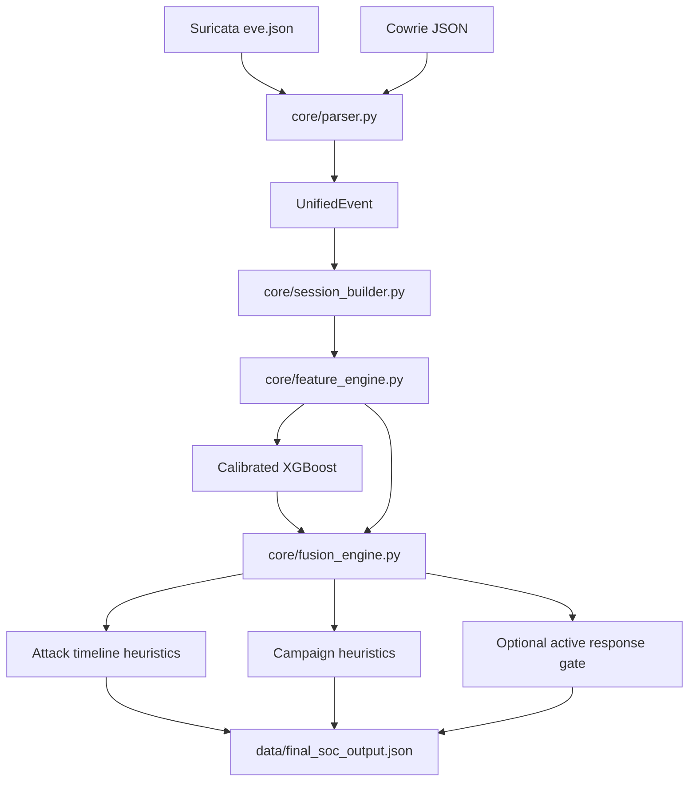

# Architecture

## System boundary

## Component responsibilities

| Component | Responsibility |
|---|---|
| `core/parser.py` | Parse Cowrie/Suricata JSON, normalize fields, deduplicate, sort events |
| `core/event_schema.py` | Shared normalized event contract |
| `core/session_builder.py` | Build source + source-IP behavioral sessions in batch mode |
| `core/feature_engine.py` | Convert sessions into numerical behavioral features |
| `ml/train_model.py` | Train and calibrate XGBoost and persist model metadata |
| `core/fusion_engine.py` | Combine ML probability and hand-tuned behavioral indicators |
| `core/attack_timeline.py` | Deterministic stage/timeline and APT-style heuristic analysis |
| `core/apt_campaign_engine.py` | Deterministic campaign fingerprinting/correlation |
| `core/active_response.py` | Optional gated lab-only response request |
| `pipeline/offline_pipeline.py` | Canonical end-to-end orchestration and SOC JSON output |

## Important boundary: hybrid does not mean cross-source session fusion

The parser produces a combined chronological event list, but the canonical session builder groups by `(source, src_ip)`. Therefore a Cowrie event and a Suricata event from the same IP are not merged into one behavioral session by the current implementation.

This distinction is intentional in the public documentation because claiming cross-source attacker correlation would overstate the implementation.

## Experimental boundary

`experimental/` contains implemented research components that are not wired into the canonical pipeline. They include MITRE mapping, Isolation Forest anomaly detection, LLM investigation summaries, and an alternate stateful session builder.
