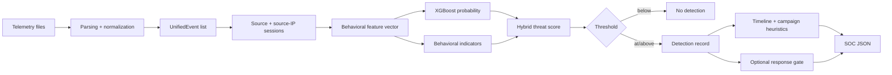

# Data Flow

## End-to-end flow

## 1. Telemetry

The parser accepts exported Cowrie JSON and Suricata `eve.json` records. It does not capture packets or tail a live stream.

## 2. Normalization

`core/parser.py` converts source records into `UnifiedEvent` objects. Timestamps are parsed, source IPs are normalized, malformed/noisy records are skipped, duplicates are filtered, and events are sorted chronologically.

## 3. Sessionization

`core/session_builder.py` groups events by source and source IP. A session is split when the event gap exceeds one hour or the event count reaches the configured maximum. Sessions with fewer than two events are discarded.

## 4. Feature engineering

`core/feature_engine.py` derives activity-volume, timing, stage, command, risk, and fan-out indicators. These features are consumed both by training and runtime inference.

## 5. ML scoring

The persisted calibrated XGBoost model receives the configured feature columns and produces a probability-like attack score.

## 6. Hybrid fusion

`core/fusion_engine.py` combines the ML score with manually weighted behavioral indicators. This is a deterministic heuristic layer, not a second learned model.

## 7. Verdict

The pipeline compares the fused score with `DETECTION_THRESHOLD`. A qualifying session becomes a detection record and is passed to timeline/campaign analysis and the optional response gate.

## 8. Output

The canonical pipeline writes a JSON artifact containing session counts, detections, campaign summary, active-response state, and timeline records.
