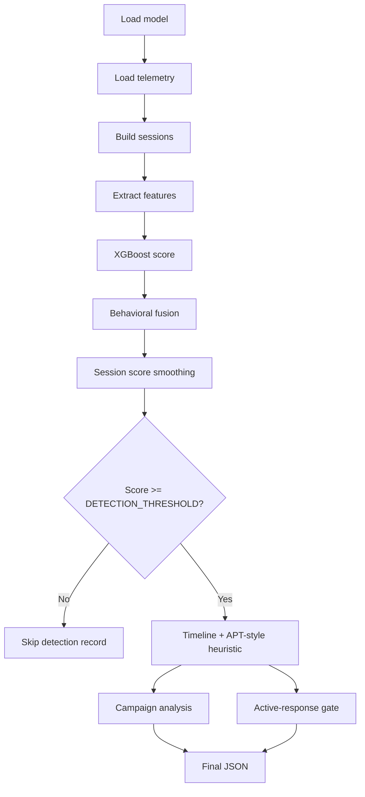

# Detection Pipeline

The canonical execution path is `pipeline/offline_pipeline.py`.

## Execution sequence

1. Load the configured trained model.
2. Read Cowrie and Suricata telemetry through `core.parser.load_events()`.
3. Build source-specific behavioral sessions.
4. Extract features for each session.
5. Align the feature vector with the persisted model feature list.
6. Compute the calibrated XGBoost score.
7. Compute the hand-tuned hybrid fusion score.
8. Apply a small per-session score-memory smoothing step.
9. Compare the final threat score with `DETECTION_THRESHOLD`.
10. For detections, build a heuristic attack timeline and APT-style level.
11. Add qualifying sessions to campaign analysis.
12. Evaluate the optional active-response gate.
13. Write the final SOC-oriented JSON artifact.

## Decision flow

## Important interpretation rules

- The `APT` field is a heuristic classification, not attribution or confirmation of an advanced persistent threat.
- Campaign grouping is deterministic fingerprinting/correlation, not a learned campaign model.
- Active response is disabled by default and must satisfy its safety gates.
- Experimental modules are not executed by this path.
